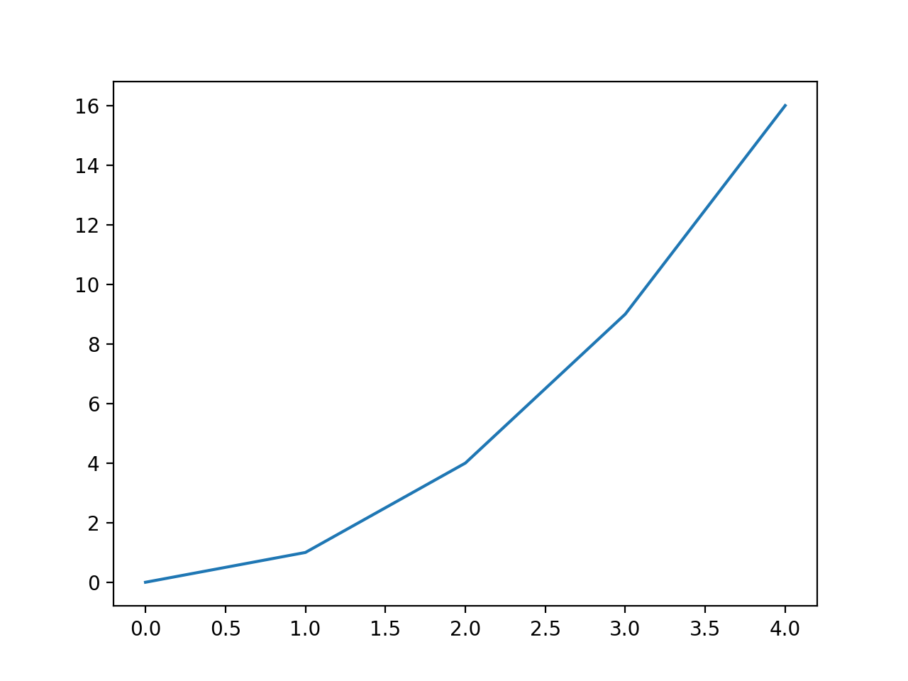

# Mostrando gráficos de funções 

Utilizando a biblioteca matplotlib, escreva dois vetores, um com os dados das coordenadas $x$ e outros com as coordenadas $y$ e "plote" os gráficos das seguintes funções: 
- $\tan(x)$ no intervalo $x \in [-\pi,\pi]$
- $\cos(x^2)$ no intervalo $x \in [-\pi,\pi]$
- $x^3-x$ no intervalo $x \in [-2,2]$
- $x^x$ no intervalo $x \in [0,1]$
- $e^{-x^2}$ no intervalo $x \in [-3,3]$
- $x^2 e^{-x}$ no intervalo $x \in [-1,5]$


## Programa para funções 

Instruções:

- Tenha instalaldo o pacote `matplotlib.pyploy` em sua máquina.
- Escreva um programa que popule duas variáveis do tipo array com os valores desejados de $x$ e $y$, por exemplo `x=[0,1,2,3,4]` e `y=[0,1,4,9,16]` para uma função do tipo quadrática.
- Em um arquivo escreva um programa como: 
```python 
import matplotlib.pyplot as plt 

x = [0,1,2,3,4]
y = [0,1,4,9,16]

plt.plot(x,y)
plt.show()
```

Esse programa vai gerar uma imagem como essa .

